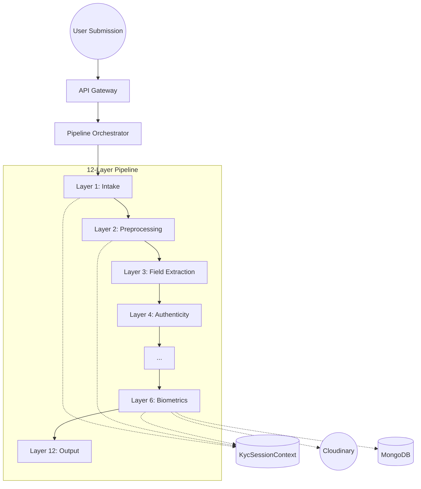

# Echelon: KYC Fraud Intelligence Platform Architecture

This document explains the technical architecture, file structure, and end-to-end execution flow of the Echelon KYC platform.

## 1. High-Level Architecture

The system is built as a **Modular Layered Pipeline**. It uses a "Contract-First" approach where each layer is an independent microservice (or a logically separated module) that communicates through a shared **Session Context**.

## 2. Execution Flow (File-to-File)

The process typically starts from the Orchestrator and moves sequentially through the layers.

### Step 1: Initialization
- **`shared/session_context.py`**: The "Source of Truth". This class holds all results from every layer. No layer modifies another layer's data directly; they only append their findings to this object.
- **`orchestration/pipeline_runner.py`**: The engine that pulls the handle. It takes a `KycSessionContext` and passes it through an array of registered services.

### Step 2: Layer 1 — Intake
- **`services/intake/app/service.py`**: The entry point for Layer 1.
- **`services/intake/domain/upload_handler.py`**: Validates raw file types and metadata.

### Step 3: Layer 2 — Document Preprocessing
- **`services/doc_preprocessing/app.py`**: A FastAPI microservice.
- **`services/doc_preprocessing/utils.py`**: The OpenCV "brain". It detects corners, warps perspective, and enhances contrast for OCR.
- **`services/doc_preprocessing/app/service.py`**: The Node/Python adapter that allows the Orchestrator to "talk" to the FastAPI service.
- **Storage**: Cloudinary (Automatic TTL for privacy). *Self-Mocking fallback included for dependency-free testing.*
- **CV/Model**: Python, FastAPI, MediaPipe, OpenCV, DeepFace/FaceNet.

### Step 4: Layer 6 — Biometrics (Deep Focus)
- **`services/biometric/backend/src/index.js`**: Express server managing the biometrics workflow.
- **`services/biometric/backend/src/api/routes/challenge.js`**: Generates a randomized movement/voice challenge.
- **`services/biometric/frontend/src/components/BiometricChallenge.jsx`**: The React UI where the user follows the dot and speaks.
- **`services/biometric/backend/src/api/routes/face.js`**: Processes the video submission.
    - Directly calls the **Python Microservice (`services/biometric/python-microservice/app.py`)** on **Port 8080** for landmarks (OpenCV-Haar).
    - *Conditional Upload*: Only saves to Cloudinary if movement verification passes.
- **`services/biometric/backend/src/api/routes/result.js`**: Aggregates all biometric signals into a final score.

## 3. Core Directory Map

| Directory | Purpose | Key Files |
| :--- | :--- | :--- |
| **`orchestration/`** | Manages the flow | `pipeline_runner.py` |
| **`shared/`** | Common code & Types | `session_context.py`, `base_service.py` |
| **`services/`** | 12 Pipeline Layers | Each layer has its own `app/`, `domain/`, and `tests/` |
| **`contracts/`** | Interface Definitions | `CONTRACT.md` in each service |
| **`schemas/`** | Data Validation | JSON/YAML schemas for inputs/outputs |

## 4. Where It Starts and Ends

1.  **Start**: An external request (Submission) hits the `Gateway` or `Orchestrator` with raw documents.
2.  **Middle**: The `PipelineRunner` loops through Layers 1 to 12.
    -   Each layer performs a specific job (e.g., Layer 2 cleans images, Layer 3 extracts text).
    -   Layers communicate via the **`KycSessionContext`**.
3.  **End**: Layer 12 generates the final API response (`REPORT`) containing the `fraud_probability` and `decision_label`.

## 5. Architectural Principles
- **Independently Deployable**: Every folder under `services/` can be run as its own microservice.
- **Traceability**: Every step is logged with source-specific prefixes (e.g., `[FaceSubmit]`).
- **Adversarial Robustness**: The system is built to evaluate its own stability using Layer 11.
