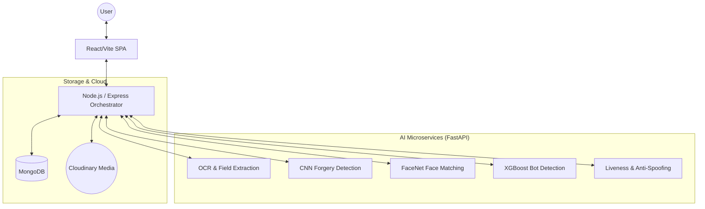

# 🛡️ DeepKYC: Synthetic Identity & Fraud Detection Platform

DeepKYC is an advanced, multi-layered identity verification system designed to detect synthetic identity fraud in real-time. By combining **Behavioral Biometrics**, **AI-Powered OCR**, **Document Forgery Analysis**, and **Liveness Verification**, it provides a robust defense against automated and manual fraud attempts.

---

## 🏗️ System Architecture

The platform follows a **Modular Neural Pipeline** architecture, where a Node.js orchestrator coordinates between a React frontend and multiple specialized Python AI microservices.



---

## 🔄 End-to-End Workflow

DeepKYC transforms raw user data into a **Consensus Trust Verdict** through a 4-step processing lifecycle:

### Step 1: Behavioral Verification
As the user enters their basic details, a specialized hook tracks **Mouse Movement Dynamics**, **Typing Cadence**, and **Interactive Patterns**.
- **Model**: XGBoost Classifier.
- **Goal**: Detect automated bot behavior and headless browser signatures.

### Step 2: Intelligent Document Audit
Users upload their Aadhaar and PAN documents. The system performs parallel processing:
1.  **Extraction**: Pytesseract/EasyOCR extracts fields (Name, UID, DOB).
2.  **Forgery Check**: CNN-based analysis detects document tampering or digital alterations.
3.  **Identity Linkage**: Cross-validates data between Aadhaar and PAN to ensure consistency.
4.  **Face Pairing**: FaceNet matches the photo on Aadhaar with the photo on PAN.

### Step 3: Biometric Neural Scan
The user performs a live challenge (following a randomized on-screen target and speaking a unique phrase).
- **Movement Tracking**: Validates nose-point landmarks via OpenCV/MediaPipe.
- **Anti-Spoofing**: CNN checks for screens, masks, or high-fidelity photos.
- **Voice verification**: ASR (Automatic Speech Recognition) matches the spoken phrase to the challenge.

### Step 4: Final Consensus Verdict
The system aggregates findings from all previous layers to generate a **Final Trust Score**.
- **Verdict**: `TRUSTED` or `SUSPICIOUS`.
- **Logic**: Weighted consensus between Behavioral, Document, and Biometric signals.

---

## 🧠 AI Models & Tech Stack

| Domain | Technology / Model | Purpose |
| :--- | :--- | :--- |
| **Frontend** | React 19, Tailwind CSS v4, Zustand | Ultra-responsive, glassmorphic UI |
| **Backend** | Node.js, Express, Mongoose | API Orchestration & Session Management |
| **Face Matching** | **DEEP FACE** (`facenet-pytorch`) | High-accuracy facial embedding comparison |
| **Bot Detection** | **XGBoost** | Behavioral biometric analysis |
| **Document Authenticity** | **VGG 16 Fine tuned** | Checks for fake document |
| **OCR** | **Yolov3** | Structured data extraction from IDs |
| **Liveness** | **OpenCV / CNN** | Anti-spoofing and landmark tracking |
| **Storage** | **MongoDB / Cloudinary**| Session persistence and secure media storage |

---

## 🛠️ Installation & Setup

### 1. Requirements
- Node.js (v18+)
- Python (v3.9+)
- MongoDB Atlas account (or local instance)
- Cloudinary API Credentials

### 2. Backend Setup
```bash
cd server
npm install
npm run dev
```

### 3. Frontend Setup
```bash
cd client
npm install
npm run dev
```

### 4. AI Microservices
Each service in `services/` can be run independently using FastAPI:
```bash
cd services/biometric/python-microservice
pip install -r requirements.txt
python app.py
```

---

## 📜 Traceability & Logging
Every verification stage is logged with a source-specific prefix for real-time auditing:
- `[KYC]` - Document & Data flow.
- `[FaceSubmit]` - Biometric liveness check.
- `[BiometricService]` - AI Microservice handshakes.

---
*Developed for Advanced Synthetic Identity Fraud Detection in Automated KYC Systems.*
